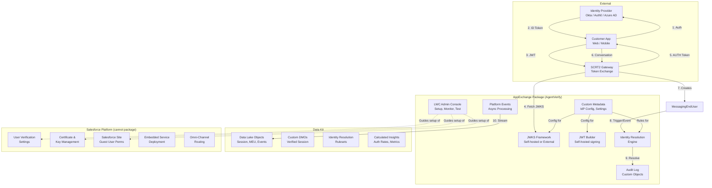
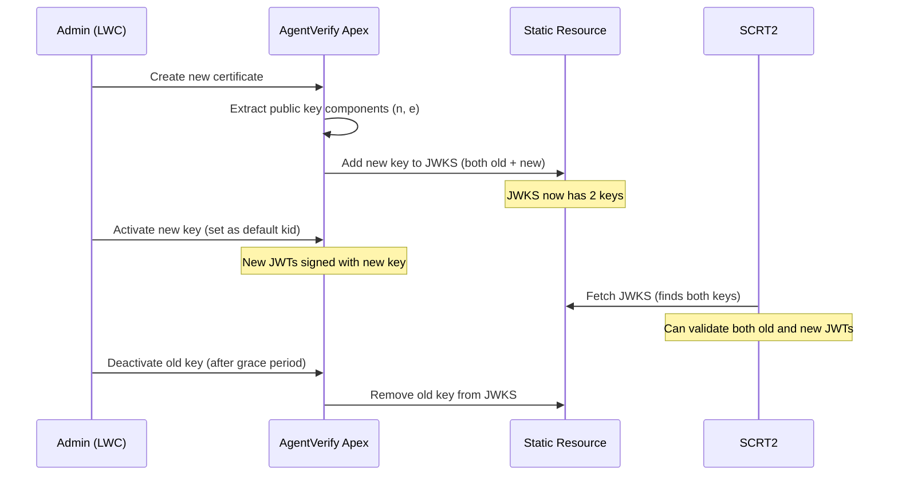
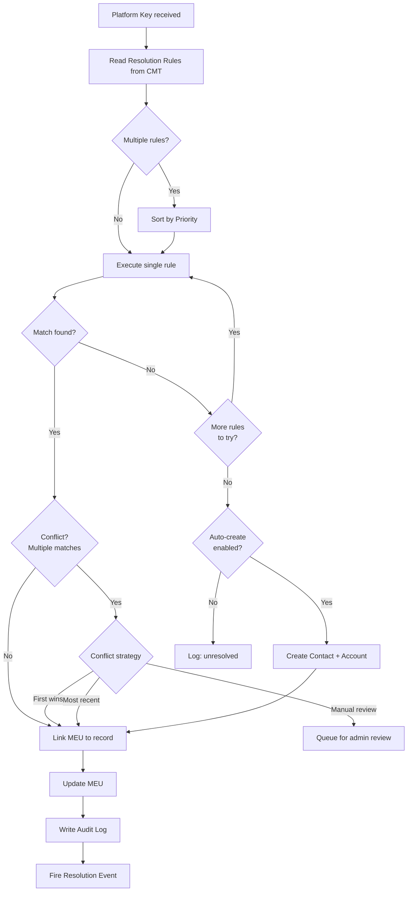

# AgentVerify — AppExchange Package Plan

> **Verified User Authentication for Agentforce Agents**
>
> An AppExchange managed package that gives any Salesforce org the ability to cryptographically verify end-user identity in Agentforce agent conversations via the MIAW Custom Client API.

---

## Table of Contents

- [1. Product Vision](#1-product-vision)
- [2. Architecture Overview](#2-architecture-overview)
- [3. Platform Constraints](#3-platform-constraints)
- [4. Package Components](#4-package-components)
- [5. Workstream 1: Configuration Framework](#5-workstream-1-configuration-framework)
- [6. Workstream 2: JWKS & JWT Framework](#6-workstream-2-jwks--jwt-framework)
- [7. Workstream 3: Identity Resolution Engine](#7-workstream-3-identity-resolution-engine)
- [8. Workstream 4: LWC Admin Console](#8-workstream-4-lwc-admin-console)
- [9. Workstream 5: Data Cloud (Data Kit)](#9-workstream-5-data-cloud-data-kit)
- [10. Workstream 6: Packaging & Distribution](#10-workstream-6-packaging--distribution)
- [11. Phasing Strategy](#11-phasing-strategy)
- [12. Open Questions](#12-open-questions)

---

## 1. Product Vision

### 1.1 Problem

Salesforce provides the verified-user flow for Agentforce agents (MIAW Custom Client API), but implementing it requires:

- Deep understanding of JWT/JWKS cryptography
- Multiple manual Setup steps that are easy to get wrong
- Custom Apex for JWKS hosting, JWT signing, and identity resolution
- No built-in tooling to monitor or debug AUTH vs ANON outcomes
- No standard way to link the verified uid to Contact/Account/Lead records
- No per-user session tracking across conversations

SCRT2 silently falls back to anonymous on ANY misconfiguration — no error, no warning. Teams waste days debugging why they get ANON instead of AUTH.

### 1.2 Solution

**AgentVerify** — install the package, run the setup wizard, connect your IdP, and verified-user auth works. The package provides:

1. **Guided setup** that validates each configuration step before moving to the next
2. **Multi-IdP support** — bring your own IdP (Okta, Auth0, Azure AD, Ping) OR use the built-in self-hosted JWKS
3. **Configurable identity resolution** — map the verified uid to Contact, Account, Lead, or User via rules (not code)
4. **Monitoring dashboard** — AUTH/ANON rates, unlinked MessagingEndUsers, resolution failures
5. **Data Cloud integration** — per-user session tracking, identity graph enrichment, engagement analytics
6. **Test tools** — generate a JWT, exchange it, verify AUTH status, all from within the admin console

### 1.3 Target Customer

- Salesforce orgs using Agentforce with external-facing agents
- Orgs that need verified identity in agent conversations (not just anonymous chat)
- ISVs building on Agentforce that need auth for their customer-facing agents

---

## 2. Architecture Overview



### 2.1 Two Modes of Operation

| Mode | JWKS Source | JWT Source | Use Case |
|------|-----------|-----------|----------|
| **External IdP** | IdP's JWKS URL (e.g. `https://your-tenant.okta.com/.well-known/jwks.json`) | IdP issues the token after user login | Production — bring your own IdP |
| **Self-Hosted** | Package's Apex JWKS endpoint on SF Site | Package's Apex JWT endpoint signs with SF certificate | Demo, testing, or orgs without an external IdP |

---

## 3. Platform Constraints

### 3.1 Cannot Be Packaged (Guided Setup Required)

These require manual admin configuration. The LWC setup wizard will guide the admin through each step and validate completion.

| Component | Why It Can't Be Packaged | Mitigation |
|-----------|-------------------------|------------|
| **User Verification settings** | No Metadata API type exists. JWKS URL + issuer must be set manually in Setup. | Setup wizard with step-by-step instructions + validation callout to check if JWKS is reachable |
| **Certificate creation** | Private keys can't be shipped. Customer must create their own. | Wizard guides cert creation, then auto-extracts public key and generates JWKS |
| **Site Guest User permissions** | Profile permissions on Guest User aren't deployable. | Wizard lists exact classes to add, with a "Check" button that verifies access |
| **Embedded Service Deployment** | Tightly coupled to customer's agent, channel, routing. | Wizard detects existing deployments and validates linkage |

### 3.2 Can Be Packaged

| Component | Package Type | Notes |
|-----------|-------------|-------|
| All Apex classes | 2GP Managed | Namespaced (e.g. `agentv__`) |
| Custom Metadata Types | 2GP Managed | IdP configs, resolution rules, settings |
| LWC components | 2GP Managed | Admin console, setup wizard |
| Custom Objects | 2GP Managed | Audit log, resolution history |
| Permission Sets | 2GP Managed | Admin, Guest User |
| Platform Events | 2GP Managed | Async identity resolution |
| Flows | 2GP Managed | Optional declarative resolution |
| Remote Site Settings | 2GP Managed | SCRT2 allowlist template |
| Data Cloud config | **Data Kit** | Bundled in same 2GP or separate |

### 3.3 Platform Risks to Investigate

<!--
COMMENT: These are unknowns that need validation before committing to the plan.
Flag any you already know the answer to.
-->

| Risk | Question | Impact if Blocked |
|------|----------|-------------------|
| **Triggers on MessagingEndUser** | Are Apex triggers supported on `MessagingEndUser`? If not, how do we detect new MEU creation? | Identity resolution must use polling, Flow, or Platform Event workaround |
| **Guest User callout limits** | Can the Guest User profile make HTTP callouts (for JWKS validation in self-hosted mode)? | May need to restructure JWKS serving |
| **SCRT2 JWKS caching** | How long does SCRT2 cache the JWKS response? Does it respect Cache-Control headers? | Impacts key rotation strategy |
| **User Verification API** | Is there any way to read/write User Verification settings via Metadata API or Tooling API? | If yes, the setup wizard could automate this step |
| **Data Kit in same 2GP** | Can the Data Kit be bundled in the same 2GP managed package, or must it be a separate package? | Affects install experience |
| **MessagingEndUser field access** | Can a managed package update `ContactId`, `AccountId`, `LeadId` on `MessagingEndUser`? Or are these system-managed? | Core to identity resolution |

---

## 4. Package Components

### 4.1 Namespace

Proposed: `agentv` (short for AgentVerify)

### 4.2 Custom Metadata Types

| API Name | Purpose | Key Fields |
|----------|---------|------------|
| `AgentVerify_IdP__mdt` | Identity Provider configuration | `Label`, `JWKS_URL__c`, `Issuer__c`, `Audience__c`, `Subject_Field__c`, `Is_Active__c`, `Mode__c` (External/SelfHosted) |
| `AgentVerify_Setting__mdt` | Global settings | `Certificate_Name__c`, `Site_URL__c`, `SCRT2_URL__c`, `Org_Id__c`, `ES_Developer_Name__c`, `Auto_Create_Contact__c`, `Auto_Create_Account__c` |
| `AgentVerify_Resolution_Rule__mdt` | Identity resolution rules | `IdP__c` (lookup), `Source_Field__c` (uid/email/phone/custom), `Target_Object__c` (Contact/Lead/User), `Target_Field__c` (Email/Phone/Custom__c), `Priority__c`, `Create_If_Not_Found__c` |
| `AgentVerify_Field_Mapping__mdt` | Field mappings for record creation | `Rule__c` (lookup), `Source__c` (e.g. "firstName"), `Target_Object__c`, `Target_Field__c` |

### 4.3 Custom Objects

| API Name | Purpose | Key Fields |
|----------|---------|------------|
| `AgentVerify_Session__c` | Tracks each verified session | `Subject__c`, `Auth_Status__c` (AUTH/ANON), `IdP__c`, `Platform_Key__c`, `Conversation_Id__c`, `Resolved__c`, `Contact__c`, `Account__c`, `Lead__c`, `Timestamp__c` |
| `AgentVerify_Resolution_Log__c` | Audit trail for identity resolution | `Session__c` (lookup), `Platform_Key__c`, `Email__c`, `Match_Type__c` (User/Contact/Lead/Created/Failed), `Before_State__c` (JSON), `After_State__c` (JSON), `Error__c` |
| `AgentVerify_Health_Check__c` | Stores periodic health check results | `Check_Type__c` (JWKS/Cert/Site/UserVerification), `Status__c` (Pass/Fail/Warning), `Detail__c`, `Timestamp__c` |

### 4.4 Platform Events

| API Name | Purpose |
|----------|---------|
| `AgentVerify_Session_Event__e` | Fired when a new verified session is detected. Subscribers: identity resolution, Data Cloud ingestion, audit logging |
| `AgentVerify_Resolution_Event__e` | Fired when identity resolution completes. Subscribers: Data Cloud update, notification |

### 4.5 Permission Sets

| Name | Purpose | Includes |
|------|---------|----------|
| `AgentVerify_Admin` | Full access to admin console, config, logs | CRUD on all custom objects, CMT edit, LWC access |
| `AgentVerify_Guest` | Minimum access for Site Guest User | Execute on JWKS endpoint, JWT endpoint, Resolve Identity endpoint |
| `AgentVerify_Agent` | For Agentforce agent service user | Read on session/resolution objects (for agent topic actions) |

---

## 5. Workstream 1: Configuration Framework

**Goal:** Replace all hardcoded values with Custom Metadata, supporting multiple IdPs and orgs.

### 5.1 Deliverables

- [ ] `AgentVerify_IdP__mdt` — multi-IdP support, active/inactive toggle
- [ ] `AgentVerify_Setting__mdt` — global settings with encrypted sensitive fields
- [ ] `AgentVerify_Resolution_Rule__mdt` — configurable identity resolution rules
- [ ] `AgentVerify_Field_Mapping__mdt` — field mappings for auto-created records
- [ ] `AgentVerifyConfig.cls` — runtime config loader that reads from CMT (replaces `AgentAPI_Config`)
- [ ] Config validation: Apex method that checks all required settings are populated and valid
- [ ] Default records: post-install script seeds sensible defaults

### 5.2 Design Decisions

<!-- COMMENT: Preferences on any of these? -->

| Decision | Options | Recommendation |
|----------|---------|----------------|
| Sensitive field storage | Protected Custom Metadata vs Custom Setting (hierarchy) vs Named Credential | Protected Custom Metadata — packageable and encrypted |
| Multi-IdP | One active at a time vs multiple simultaneous | Multiple simultaneous — route by ES Deployment or domain |
| Org ID source | Hardcoded in CMT vs `UserInfo.getOrganizationId()` at runtime | Runtime — no config needed |

**Complexity: Small-Medium**

---

## 6. Workstream 2: JWKS & JWT Framework

**Goal:** Production-grade JWKS endpoint and JWT builder with key rotation support. Both self-hosted mode (SF cert) and external IdP mode.

### 6.1 Deliverables

- [ ] `AgentVerifyJwksEndpoint.cls` — `@RestResource` serving JWKS JSON with proper Cache-Control headers
- [ ] `AgentVerifyJwtBuilder.cls` — builds and signs JWTs using configured certificate
- [ ] `AgentVerifyJwtEndpoint.cls` — `@RestResource` for external callers (web app, mobile) to request signed JWTs
- [ ] Key rotation support: multiple keys in JWKS, `kid` selection, graceful rollover
- [ ] JWKS auto-generation: given a certificate name, extract public key and build JWKS JSON automatically (no manual openssl step)
- [ ] JWKS caching strategy: Static Resource for fast serving, regenerate on cert change
- [ ] External IdP mode: validate that the IdP's JWKS endpoint is reachable and returns valid JSON

### 6.2 Key Rotation Flow



### 6.3 Design Decisions

<!-- COMMENT: The JWKS auto-generation from cert is the key UX improvement over our demo.
     Currently we do: create cert → export → openssl → manual JSON → upload Static Resource.
     The package should do: create cert → click "Generate JWKS" → done.
     Question: Can Apex read the public key components from a certificate?
     Crypto.sign works but I haven't confirmed Crypto can export modulus/exponent. -->

| Decision | Options | Recommendation |
|----------|---------|----------------|
| JWKS storage | Static Resource vs Custom Metadata vs Custom Setting | Static Resource — fast, cacheable, no SOQL |
| Auto-generate JWKS from cert | Apex `Crypto` class vs require admin to paste modulus/exponent | Apex if possible — needs investigation (see §12) |
| Cache-Control header | Short TTL (5 min) vs long (24h) | Short during setup, long in production — configurable |
| Multiple simultaneous keys | 2 max vs unlimited | 3 max (previous, current, next) — covers rotation |

**Complexity: Medium**

---

## 7. Workstream 3: Identity Resolution Engine

**Goal:** Configurable rules engine that maps the verified uid to Salesforce records, replacing the hardcoded email-lookup demo.

### 7.1 Deliverables

- [ ] `IdentityResolver` interface — pluggable strategy pattern
- [ ] `EmailResolver.cls` — resolve by email (User → Contact → Lead)
- [ ] `PhoneResolver.cls` — resolve by phone number
- [ ] `ExternalIdResolver.cls` — resolve by custom field / external ID
- [ ] `FederationIdResolver.cls` — resolve by User Federation ID
- [ ] `IdPCalloutResolver.cls` — call external IdP userinfo endpoint to get email, then resolve
- [ ] `ResolutionOrchestrator.cls` — reads rules from CMT, executes in priority order, handles conflicts
- [ ] Record creation: auto-create Contact/Account when configured and no match found
- [ ] Conflict handling: configurable strategy (first match wins, most recent, manual review queue)
- [ ] `AgentVerify_Resolution_Log__c` — audit every resolution attempt with before/after state
- [ ] Bulk-safe: handle multiple MEUs in single transaction (trigger context)
- [ ] REST endpoint: `resolveIdentity(subject)` for external callers
- [ ] Invocable Apex: `@InvocableMethod` for Flow-based resolution

### 7.2 Resolution Flow



### 7.3 Design Decisions

<!-- COMMENT: The big question is whether to support triggers on MessagingEndUser.
     If triggers aren't supported, the resolution must be invoked externally
     (REST call from the client app, or a scheduled batch scanning for unresolved MEUs). -->

| Decision | Options | Recommendation |
|----------|---------|----------------|
| Invocation | Trigger on MEU vs REST endpoint vs Platform Event vs Scheduled batch | All of the above — customer chooses per their architecture |
| Conflict strategy | First match vs most recent vs admin queue | Configurable per rule in CMT |
| Auto-create scope | Contact only vs Contact + Account vs Contact + Account + Case | Configurable — default Contact + Account |
| External IdP callout | Synchronous vs async (Platform Event) | Async — IdP callouts shouldn't block MEU processing |
| Namespace on MEU fields | Can managed package update `ContactId` on `MessagingEndUser`? | Needs validation — see §12 |

**Complexity: Medium-Large**

---

## 8. Workstream 4: LWC Admin Console

**Goal:** A single-pane admin experience for setup, configuration, monitoring, and testing. The setup wizard is the package's primary UX differentiator.

### 8.1 Component Map

```
AgentVerify Admin Console (Lightning App)
├── Setup Wizard (agentverify-setup-wizard)
│   ├── Step 1: Certificate Setup
│   ├── Step 2: JWKS Configuration
│   ├── Step 3: Salesforce Site
│   ├── Step 4: User Verification
│   ├── Step 5: Embedded Service Deployment
│   ├── Step 6: Identity Resolution Rules
│   └── Step 7: Validation & Test
│
├── IdP Manager (agentverify-idp-manager)
│   ├── IdP List (CRUD)
│   ├── IdP Detail / Edit
│   ├── Test Connection (fetch JWKS, validate)
│   └── Activate / Deactivate
│
├── Resolution Rules (agentverify-resolution-rules)
│   ├── Rule List (priority-ordered)
│   ├── Rule Builder (source field, target object, strategy)
│   ├── Field Mapping Editor
│   └── Test Resolution (enter a uid, see what it resolves to)
│
├── Monitoring Dashboard (agentverify-dashboard)
│   ├── AUTH vs ANON Rate (chart — last 7/30/90 days)
│   ├── Resolution Success Rate (chart)
│   ├── Unlinked MEUs (list — Guest name, no Contact)
│   ├── Recent Sessions (table with drill-down)
│   ├── Error Log (recent failures)
│   └── Health Checks (JWKS reachable, cert valid, Site accessible)
│
├── Test Tool (agentverify-test-tool)
│   ├── Generate JWT (select IdP, enter subject)
│   ├── Exchange JWT (call SCRT2, show AUTH/ANON)
│   ├── Resolve Identity (enter platform key, show result)
│   └── Full Flow Test (all steps with live output)
│
└── Settings (agentverify-settings)
    ├── Global Settings Editor
    ├── Data Cloud Connection Status
    └── Package Info / Version
```

### 8.2 Setup Wizard Detail

The wizard is the critical onboarding experience. Each step validates before allowing the admin to proceed.

| Step | What the Admin Does | What the Wizard Validates |
|------|--------------------|-----------------------|
| 1. Certificate | Creates cert in Setup (opens in new tab) → enters cert name in wizard | Apex checks `Crypto.signWithCertificate` works with the named cert |
| 2. JWKS | Clicks "Generate JWKS from Certificate" OR enters external IdP JWKS URL | Fetches JWKS URL, validates JSON structure, confirms `kid` matches |
| 3. Site | Creates/selects SF Site, adds Apex classes to Guest User access | Calls the JWKS endpoint publicly to verify it returns JSON |
| 4. User Verification | Opens User Verification Setup (new tab), enters JWKS URL + issuer | Attempts a test JWT exchange with SCRT2 — if AUTH, the chain works end-to-end |
| 5. ES Deployment | Selects existing deployment or creates new | Queries `EmbeddedServiceConfig` to verify deployment exists and has a messaging channel |
| 6. Resolution Rules | Configures identity resolution rules via the rule builder | Runs a test resolution with a sample uid |
| 7. Validate | Runs full end-to-end health check | All green = ready to go |

### 8.3 Design Decisions

<!-- COMMENT: The wizard step 4 (User Verification) is the most fragile.
     We can't automate it, and validating it requires actually exchanging a JWT
     and seeing if we get AUTH back. That means the cert, JWKS, and Site must
     all be working BEFORE we can validate User Verification. The step order matters. -->

| Decision | Options | Recommendation |
|----------|---------|----------------|
| Admin console location | Lightning App (tab) vs Setup App vs Utility Bar | Lightning App with custom tab — most visible |
| Setup wizard persistence | Resume where you left off vs start over | Persist progress in `AgentVerify_Health_Check__c` |
| Dark theme support | Yes vs no | Follow SLDS, which handles both automatically |
| Mobile support | LWC mobile-responsive vs desktop only | Desktop only — this is admin tooling |

**Complexity: Large**

---

## 9. Workstream 5: Data Cloud (Data Kit)

**Goal:** Per-user session tracking, identity graph enrichment, and engagement analytics via Data Cloud. Packaged as a Data Kit bundled with the managed package.

### 9.1 Data Kit Contents

| Component | Type | Purpose |
|-----------|------|---------|
| `AgentVerify_Session` | Custom DLO/DMO | Verified session data: subject, auth status, conversation ID, timestamps |
| `AgentVerify_Identity` | Custom DLO/DMO | Identity resolution data: uid, matched record type, Contact/Lead ID |
| `AgentVerify_Engagement` | Custom DLO/DMO | Per-message engagement: message count, response times, topics discussed |
| Identity Resolution Ruleset | IR Config | Match rules linking AgentVerify sessions to Unified Individual via Contact/Lead |
| `Party_Identification` mapping | DMO Mapping | Maps the verified uid as an external identifier on the Individual |
| `Auth_Rate_By_IdP` | Calculated Insight | AUTH vs ANON breakdown by identity provider |
| `Session_Volume_By_User` | Calculated Insight | Conversation frequency per verified user |
| `Unresolved_Sessions` | Calculated Insight | Sessions where identity resolution failed |

### 9.2 Ingestion Pipeline (Apex)

```mermaid
flowchart LR
    A[MessagingEndUser<br/>created/updated] -->|Trigger or Flow| B[Platform Event<br/>AgentVerify_Session_Event__e]
    B -->|Apex Subscriber| C[AgentVerifyDcIngestion.cls]
    C -->|Queueable callout| D[Data Cloud<br/>Ingestion API]
    D --> E[DLO: AgentVerify_Session]
    E -->|Data Transform| F[DMO: Verified Session]
    F -->|Identity Resolution| G[Unified Individual]
```



### 9.3 Deliverables

- [ ] Data Kit YAML definitions for all DLOs/DMOs
- [ ] Identity Resolution ruleset configuration
- [ ] Calculated Insight definitions
- [ ] `AgentVerifyDcIngestion.cls` — Apex callout to Ingestion API (streaming)
- [ ] `AgentVerifyDcAuth.cls` — Auth Provider for Data Cloud OAuth
- [ ] Named Credential template for Data Cloud API
- [ ] Platform Event subscriber with `PlatformEventSubscriberConfig`
- [ ] Retry/compensation: custom object queue for failed ingestion attempts
- [ ] Batch job: backfill historical sessions into Data Cloud

### 9.4 Design Decisions

<!-- COMMENT: The big question is whether the Data Kit can be in the same 2GP
     as the core package or needs to be a separate install. Also, does the
     customer need Data Cloud licenses? If so, this becomes an add-on, not core. -->

| Decision | Options | Recommendation |
|----------|---------|----------------|
| Data Kit bundling | Same 2GP as core vs separate package | Separate — not all customers have Data Cloud |
| Ingestion trigger | Apex trigger on MEU vs Platform Event vs CDC | Platform Event — most reliable, works even if MEU triggers aren't supported |
| Retry strategy | Custom object queue vs Platform Event replay | Custom object queue — PE replay has limits |
| Backfill | One-time batch vs on-demand | On-demand via admin console button |
| Data Cloud licensing | Require Data Cloud vs make it optional | Optional add-on — core package works without it |

**Complexity: Medium**

---

## 10. Workstream 6: Packaging & Distribution

### 10.1 Package Structure

```
AgentVerify (2GP Managed Package)
├── Core Package (required)
│   ├── Apex classes (namespaced: agentv__)
│   ├── Custom Metadata Types
│   ├── Custom Objects
│   ├── LWC components
│   ├── Permission Sets
│   ├── Platform Events
│   └── Flows
│
└── Data Cloud Add-on (optional, separate install)
    └── Data Kit
        ├── DLO/DMO definitions
        ├── Identity Resolution rulesets
        ├── Calculated Insights
        └── Ingestion pipeline Apex
```

### 10.2 Deliverables

- [ ] Namespace registration (`agentv`)
- [ ] Dev Hub setup for 2GP development
- [ ] Scratch org definition with all dependencies
- [ ] Post-install Apex script (seed default CMT records, create permission set assignments)
- [ ] Upgrade script (handle schema changes between versions)
- [ ] Test coverage: 75%+ overall (AppExchange requirement)
- [ ] Security Review preparation (no hardcoded credentials, CRUD/FLS enforcement, XSS prevention)
- [ ] AppExchange listing (screenshots, description, install guide)
- [ ] Trialforce org template for prospects
- [ ] ISV partner registration (if not already done)

### 10.3 Security Review Checklist

<!-- COMMENT: Security Review is often the longest lead-time item.
     Plan for 4-6 week review cycle. -->

| Requirement | How We Address It |
|-------------|-------------------|
| No hardcoded credentials | All config in Custom Metadata (encrypted where sensitive) |
| CRUD/FLS enforcement | Use `WITH SECURITY_ENFORCED` or `Security.stripInaccessible()` |
| No SOQL injection | Bind variables only (no dynamic query strings from user input) |
| XSS prevention | LWC handles this natively; Apex REST endpoints return JSON only |
| HTTPS only | All callouts via Named Credentials; JWKS served via SF Site (HTTPS) |
| No system-mode access leaks | `with sharing` by default; `without sharing` only for MEU resolution (documented) |
| Governor limit safety | Bulk-safe patterns, async processing via Platform Events |

---

## 11. Phasing Strategy

### Phase 1: Core (MVP)

**Ship a working auth package without Data Cloud.**

| Workstream | Scope |
|-----------|-------|
| Config Framework | Full — CMT, settings, multi-IdP |
| JWKS/JWT Framework | Full — self-hosted + external IdP |
| Identity Resolution | Core — email + external ID resolvers, REST endpoint, basic rules |
| LWC Admin Console | Setup wizard + test tool + basic monitoring |
| Packaging | 2GP managed package, Security Review |

**What the customer gets:**
- Install → run wizard → verified auth works
- Configure identity resolution rules (no code)
- Test tool to validate the chain end-to-end
- Basic monitoring (AUTH/ANON rates, unlinked MEUs)

### Phase 2: Advanced Resolution + Monitoring

| Workstream | Scope |
|-----------|-------|
| Identity Resolution | Advanced — phone resolver, IdP callout resolver, conflict handling, admin review queue |
| LWC Admin Console | Full monitoring dashboard, resolution rules builder, health checks |
| Packaging | Upgrade path from Phase 1 |

### Phase 3: Data Cloud

| Workstream | Scope |
|-----------|-------|
| Data Cloud | Full Data Kit — session tracking, identity graph, calculated insights |
| LWC Admin Console | Data Cloud connection status, backfill tool |
| Packaging | Separate Data Kit add-on package |

---

## 12. Open Questions

<!--
COMMENT: These need answers before development starts.
Mark each with your input or flag for investigation.
-->

| # | Question | Status | Notes |
|---|----------|--------|-------|
| 1 | **Are Apex triggers supported on `MessagingEndUser`?** | Needs investigation | If not, resolution must be invoked via REST, Flow, or scheduled batch. This is a fundamental architecture decision. |
| 2 | **Can a managed package update `ContactId`, `AccountId`, `LeadId` on `MessagingEndUser`?** | Needs investigation | These might be system-managed fields. If we can't write to them, the entire resolution engine needs a different approach. |
| 3 | **Can Apex extract public key components (modulus, exponent) from a certificate?** | Needs investigation | If yes, we can auto-generate JWKS from cert (huge UX win). If not, admin must manually extract via openssl. |
| 4 | **How long does SCRT2 cache JWKS responses?** | Needs investigation | Impacts key rotation timing. If SCRT2 caches for 24h, rotations need a 24h grace period. |
| 5 | **Is there any Metadata API type for User Verification settings?** | Needs investigation | Even read-only access would help the wizard validate configuration. |
| 6 | **Can a Data Kit be bundled in the same 2GP, or must it be separate?** | Needs investigation | Affects install experience and pricing model. |
| 7 | **Does the customer need Data Cloud licenses for the Data Kit add-on?** | Likely yes | If so, Data Cloud is a premium add-on, not a core feature. |
| 8 | **What Salesforce editions support User Verification?** | Needs investigation | Determines target market — Enterprise only? Unlimited? |
| 9 | **Is there a partner/ISV program for Agentforce extensions?** | Needs investigation | May provide additional APIs or early access. |
| 10 | **Can `without sharing` be used in a managed package for MEU access?** | Needs Security Review input | Required for Guest User resolution, but Security Review may flag it. |

---

## Appendix: Existing Proof of Concept

This plan builds on the working demo at:
**https://github.com/DavidVickers/agent-api-verified-user-flow**

| Demo Component | Package Equivalent |
|---------------|-------------------|
| `AgentAPI_Config.cls` | `AgentVerify_Setting__mdt` + `AgentVerifyConfig.cls` |
| `AgentAPI_Step4_JwksEndpoint.cls` | `AgentVerifyJwksEndpoint.cls` (with key rotation) |
| `AgentAPI_JwtRestEndpoint.cls` | `AgentVerifyJwtEndpoint.cls` (multi-IdP) |
| `AgentAPI_ResolveIdentity.cls` | `ResolutionOrchestrator.cls` + pluggable resolvers |
| `AgentAPI_Orchestrator.cls` | LWC Test Tool |
| `web-demo/` | LWC Admin Console embedded test tool |
| `SETUP_GUIDE.md` | LWC Setup Wizard (interactive) |
| Hardcoded email lookup | Configurable resolution rules (CMT) |
| Single IdP | Multi-IdP support |
| No monitoring | LWC Dashboard + Custom Objects |
| No Data Cloud | Data Kit add-on |
