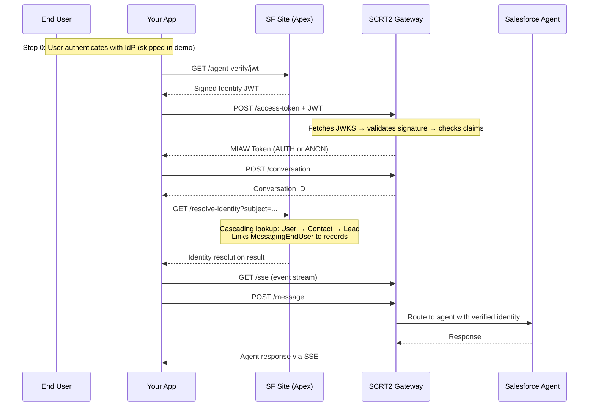
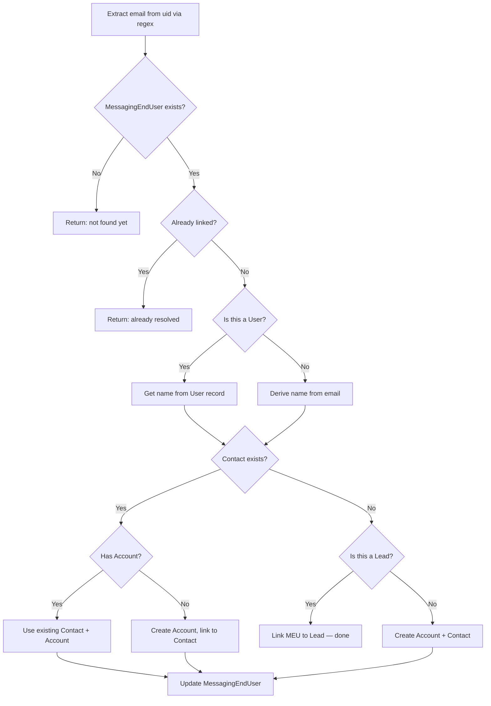
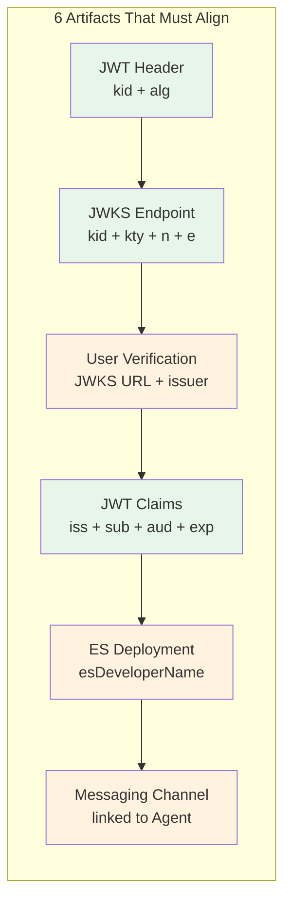

# Salesforce Agent API — Verified User Flow (End-to-End Demo)

> A complete, working demonstration of the Salesforce **Agents API verified-user flow** using the MIAW (Messaging for In-App and Web) Custom Client API. Proves the full identity verification chain from JWT signing through agent conversation with verified context.

**Status: Working** — Full end-to-end flow confirmed. Agent responds with verified user context.

---

## What This Proves

Salesforce Agents can verify the identity of external users through a cryptographic JWT flow. This project demonstrates every step of that chain — from signing the identity token to receiving an agent response in a verified context.



## Key Insight: AUTH vs ANON

SCRT2 returns **HTTP 200 OK regardless of whether verification succeeded or failed**. It silently falls back to anonymous. The **only** way to know:

| Subject Pattern | Meaning |
|----------------|---------|
| `v2/iamessage/AUTH/agentverifykeys/uid:user@example.com` | Verified |
| `v2/iamessage/ANON/...` | Anonymous (verification failed silently) |

---

## Project Structure

```
├── agent-api-verify/          # Salesforce DX project (Apex classes)
│   └── force-app/main/default/classes/
│       ├── AgentAPI_Step1_BuildJwt.cls         # Sign identity JWT with SF certificate
│       ├── AgentAPI_Step2_GetMiawToken.cls      # Exchange JWT for MIAW token via SCRT2
│       ├── AgentAPI_Step3_CreateConversation.cls # Create MIAW conversation
│       ├── AgentAPI_Step4_SendMessage.cls        # Send message as verified user
│       ├── AgentAPI_Step4_JwksEndpoint.cls       # Public JWKS endpoint (SF Site)
│       ├── AgentAPI_Step5_EndConversation.cls    # Log conversation summary
│       ├── AgentAPI_ResolveIdentity.cls          # Resolve uid → Contact/Account/Lead
│       ├── AgentAPI_JwtRestEndpoint.cls          # Public JWT signing endpoint
│       ├── AgentAPI_Orchestrator.cls             # Runs full flow from Anonymous Apex
│       ├── AgentAPI_Config.cls                   # Central configuration
│       ├── AgentAPI_Logger.cls                   # Debug output formatter
│       ├── AgentAPI_JwtUtils.cls                 # JWT/Base64URL utilities
│       ├── AgentAPI_Exception.cls                # Custom exception
│       └── *Test.cls                             # Test classes (15/15 passing)
│
├── web-demo/                  # Browser chat UI (Express + vanilla JS)
│   ├── server.js              # JWT + resolve-identity proxy
│   ├── public/
│   │   ├── index.html         # Chat interface with flow diagram
│   │   ├── app.js             # Full MIAW flow + SSE via fetch streaming
│   │   └── style.css          # Salesforce-blue theme
│   └── .env.example
│
├── node-test/                 # Node.js CLI test (mirrors Python)
│   ├── agent-api-test.js      # Full E2E flow with SSE
│   └── .env.example
│
├── python-test/               # Python CLI test (original)
│   ├── agent_api_test.py      # Full E2E flow with SSE
│   └── .env.example
│
├── SETUP_GUIDE.md             # Comprehensive setup guide (§numbered sections)
└── README.md                  # This file
```

---

## Quick Start

### 1. Deploy Apex to Your Org

```bash
cd agent-api-verify
sf org login web -a myorg
sf project deploy start --source-dir force-app
sf apex run test --test-level RunLocalTests --wait 10
```

### 2. Salesforce Setup (Manual)

These steps must be done in Setup — see [SETUP_GUIDE.md](SETUP_GUIDE.md) for full detail:

1. **Certificate:** Create self-signed cert `AgentVerifyCert` (Setup > Certificate and Key Management)
2. **Static Resource:** Export cert, extract public key, create JWKS JSON, upload as `AgentVerifyJWKS`
3. **Salesforce Site:** Create site exposing `AgentAPI_Step4_JwksEndpoint`, `AgentAPI_JwtRestEndpoint`, and `AgentAPI_ResolveIdentity` to Guest User
4. **Embedded Service Deployment:** Create with Messaging channel linked to your Agent
5. **User Verification:** Register your JWKS URL, set issuer to match `AgentAPI_Config.JWT_ISSUER`
6. **Remote Site Setting:** Allow callouts to `*.my.salesforce-scrt.com`
7. **Agent:** Ensure at least one topic is configured (optionally verified-user-only)

### 3. Run a Test

**Node.js (recommended):**
```bash
cd node-test
cp .env.example .env  # Edit with your org values
npm install
node agent-api-test.js
```

**Python:**
```bash
cd python-test
cp .env.example .env  # Edit with your org values
pip install -r requirements.txt
python agent_api_test.py
```

**Web Demo:**
```bash
cd web-demo
cp .env.example .env  # Edit with your org values
npm install
npm start
# Open http://localhost:3000
```

**Anonymous Apex:**
```java
AgentAPI_Orchestrator.execute();
```

---

## Identity Resolution — A Sample Approach

After verification, the `MessagingEndUser` record shows `Name = "Guest"` with no Contact, Account, or Lead linked. **You must resolve the identity yourself.**

This project includes `AgentAPI_ResolveIdentity` as **one demonstration approach** — it is not the only way to do this. The approach you choose depends on your identity model, data architecture, and org requirements.

### What Our Demo Does

Extracts the email from the `uid:` portion of the MIAW platform key and does a cascading lookup:



### Why This Is Just One Approach

The `uid` in the platform key is whatever you put in the JWT `sub` claim. It might not be an email:

| Scenario | uid Format | Resolution Strategy |
|----------|-----------|---------------------|
| **Email-based IdP** | `uid:user@example.com` | Direct email lookup (our demo) |
| **Okta / Auth0 / Azure AD** | `uid:00u1234567890` | Call IdP userinfo → get email → lookup |
| **Custom IdP** | `uid:EMP-12345` | Custom field lookup (e.g. `Employee_Id__c`) |
| **Federated identity** | `uid:saml-assertion-id` | Lookup via Federation ID on User |
| **Phone-based** | `uid:+15551234567` | Lookup Contact/Lead by Phone |

### Alternative Implementations

| Approach | When to Use |
|----------|-------------|
| Apex REST service (our demo) | External callers need to trigger resolution |
| Apex Trigger on `MessagingEndUser` | Fully automatic on record creation |
| Flow on `MessagingSession` | Declarative / admin-friendly |
| Invocable Apex from Flow | Hybrid — flow triggers, Apex resolves |
| Platform Event + subscriber | Async with retry capability |
| Agent topic action | Agent resolves identity during conversation |

---

## The Verification Chain

Understanding what must match is the most important thing in this project. See [SETUP_GUIDE.md §2](SETUP_GUIDE.md) for the full chain.



If **any one** of these is wrong, SCRT2 silently falls back to ANON. No error, no warning — just a 200 OK with an anonymous token.

---

## MIAW vs Agent API

This project uses the **MIAW Custom Client API**, not the headless Agent API. They are completely different:

| | MIAW Custom Client API | Agent API (Headless) |
|---|---|---|
| **Base URL** | `*.salesforce-scrt.com/iamessage/api/v2/` | `api.salesforce.com/einstein/ai-agent/v1/` |
| **Identity** | JWT-based, cryptographic (AUTH/ANON) | OAuth token or variables |
| **MessagingEndUser** | Created per conversation | Does not exist |
| **Routing** | Full Omni-Channel routing | Direct call by Agent ID |
| **SSE / Events** | Yes (routing, messages, typing) | Optional streaming |
| **Human Handoff** | Built-in | Not supported |

See [SETUP_GUIDE.md §9](SETUP_GUIDE.md) for the complete comparison.

---

## Documentation

- **[SETUP_GUIDE.md](SETUP_GUIDE.md)** — Comprehensive guide with §numbered sections covering architecture, verification chain, org setup, API calls, troubleshooting, and more
- **Apex class docstrings** — Each class has detailed comments with §references back to the setup guide

## Test Results

All Apex tests pass:

```
15/15 tests passed — 100% pass rate
AgentAPI_ResolveIdentityTest (15 tests)
AgentAPI_Step1_BuildJwtTest
AgentAPI_Step2_GetMiawTokenTest
AgentAPI_Step3_CreateConversationTest
AgentAPI_Step4_SendMessageTest
AgentAPI_GetAgentResponseTest
AgentAPI_Step5_EndConversationTest
AgentAPI_Step4_JwksEndpointTest
AgentAPI_OrchestratorTest
```

---

## License

This is a demonstration project for educational purposes. Use at your own risk. In production, the public REST endpoints should be secured behind a Connected App with proper authentication.
