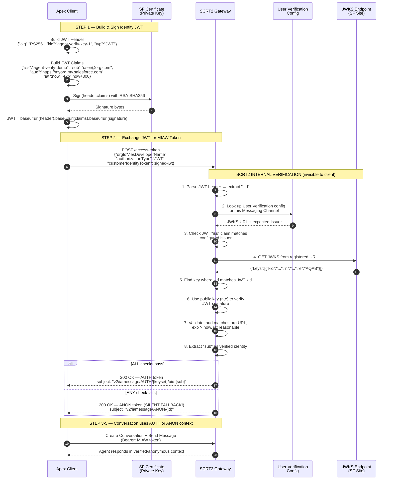
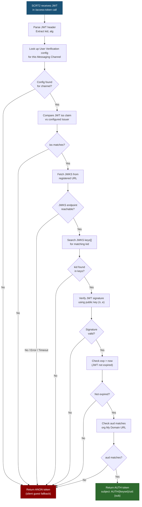
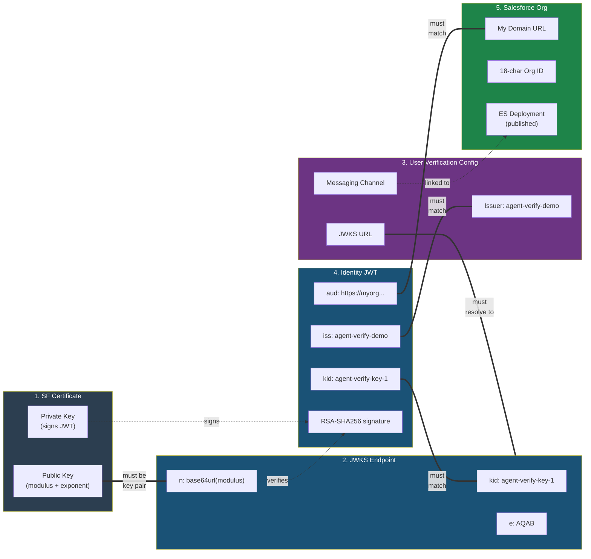
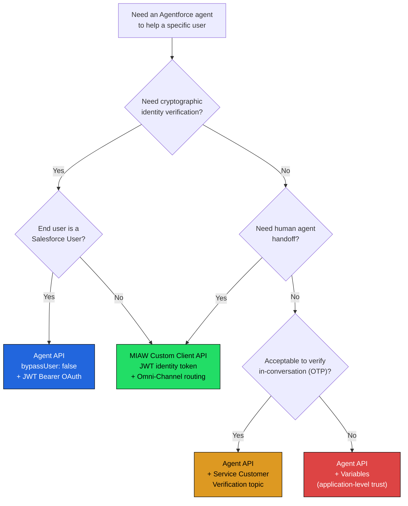

# Agent API Verified User Flow — Setup Guide

> Step-by-step guide to proving the Salesforce Agents API verified-user flow end-to-end using Apex, the MIAW (Messaging for In-App and Web) Custom Client API, and a self-contained JWKS.
>
> **Status: WORKING** — Full end-to-end flow confirmed via Python SSE test on 2026-02-17.
> Agent responded: *"Hi, I'm an AI service assistant. How can I help you?"*

---

## §1 Architecture Overview

The verified user flow uses the **Enhanced Chat API (MIAW Custom Client)**, NOT the headless Agent API. The key chain is:

```
Build identity JWT (signed with SF certificate)
  --> Exchange JWT for MIAW access token via SCRT2 endpoint
  --> Create conversation (routed to agent via Omni-Channel)
  --> Subscribe to SSE (event stream for async responses)
  --> Send message in verified user context
  --> Agent responds via SSE with verified-user context
```

### §1.1 Key URLs

| Purpose | URL Pattern |
|---------|-------------|
| SCRT2 / MIAW API | `https://{MY_DOMAIN_PREFIX}.my.salesforce-scrt.com` |
| JWKS Endpoint | `https://{SITE_URL}/services/apexrest/jwks` |
| JWT Signing (Python) | `https://{SITE_URL}/services/apexrest/agent-verify/jwt` |
| Identity Resolution | `https://{SITE_URL}/services/apexrest/agent-verify/resolve-identity?subject=...` |
| SSE Event Stream | `https://{MY_DOMAIN_PREFIX}.my.salesforce-scrt.com/eventrouter/v1/sse` |

### §1.2 Key IDs

| Item | Where to Find |
|------|---------------|
| Org ID (18-char) | Setup > Company Information |
| Agent ID (BotDefinition) | SOQL: `SELECT Id, DeveloperName FROM BotDefinition` |
| ES Deployment Developer Name | Setup > Embedded Service Deployments |
| Messaging Channel Address ID | SCRT2 token response: `context.configuration.embeddedServiceMessagingChannel.channelAddressIdentifier` |

---

## §2 The Verification Chain — What Must Match (and What Silently Fails)

Understanding this chain is **the single most important thing** in this entire guide. SCRT2 performs a multi-step verification when you exchange a JWT for a MIAW access token. If **any** step fails, SCRT2 does **NOT return an error** — it silently falls back to an anonymous (ANON/guest) token. You will get a 200 OK either way. The only way to know if verification succeeded is to check `context.endUser.subject` in the response for `AUTH` vs `ANON`.

### §2.1 The Full Verification Sequence



### §2.2 SCRT2 Internal Verification Decision Tree



### §2.3 Everything That Must Match — The 6-Artifact Checklist

There are **6 linked artifacts** that must all be consistent. If any single value is wrong, verification silently fails:



#### §2.3.1 Certificate ↔ JWKS (Cryptographic Link)

| Certificate | JWKS | Must Match? |
|-------------|------|-------------|
| Private key (used by `Crypto.signWithCertificate`) | `n` (modulus) and `e` (exponent) | The JWKS public key MUST be the mathematical pair of the certificate's private key. Extract via `openssl`. |

If these don't match: signature verification fails → **ANON**.

#### §2.3.2 JWT Header ↔ JWKS (Key Identifier)

| JWT Header | JWKS | Must Match? |
|------------|------|-------------|
| `kid` (e.g., `agent-verify-key-1`) | `kid` in the matching key object | EXACT string match. SCRT2 searches `keys[]` for this `kid`. |
| `alg` (must be `RS256`) | `alg` in the key object | Must both be `RS256`. |

If `kid` not found: SCRT2 can't find the right public key → **ANON**.

#### §2.3.3 JWT Claims ↔ User Verification Config (Trust Anchor)

| JWT Claim | Config Setting | Must Match? |
|-----------|----------------|-------------|
| `iss` (e.g., `agent-verify-demo`) | **Issuer** in User Verification | EXACT string match. Case-sensitive. |

If `iss` doesn't match: SCRT2 rejects the issuer → **ANON**.

#### §2.3.4 JWT Claims ↔ Salesforce Org (Audience & Time)

| JWT Claim | Expected Value | Must Match? |
|-----------|----------------|-------------|
| `aud` | Your org's My Domain URL (e.g., `https://myorg.my.salesforce.com`) | EXACT match including `https://` prefix. |
| `exp` | Current time | Must be **in the future** (JWT not expired). |
| `iat` | Current time | Must be **reasonable** (not too far in past or future). |

If `aud` wrong or JWT expired → **ANON**.

#### §2.3.5 User Verification Config ↔ JWKS Endpoint (Discovery)

| Config | JWKS Endpoint | Must Match? |
|--------|---------------|-------------|
| Registered JWKS URL | The actual endpoint serving JWKS JSON | URL must resolve. Endpoint must return valid JSON with `keys[]` array. Must be publicly accessible (no auth). |
| Associated Messaging Channel | The channel used by your Embedded Service Deployment | The keyset must be linked to the correct channel. |

If JWKS unreachable, returns error, or not linked to channel → **ANON**.

#### §2.3.6 API Call ↔ Embedded Service Deployment

| API Parameter | Deployment | Must Match? |
|---------------|------------|-------------|
| `esDeveloperName` | Deployment Developer Name | EXACT match. |
| `orgId` | Actual org ID | Must be 18-character org ID. |

If deployment not published or name wrong → error (not silent, but a different failure mode).

### §2.4 Why It Silently Falls Back (The Trap)

This is the most dangerous aspect of the verification flow:

> **SCRT2 returns HTTP 200 for BOTH verified and anonymous tokens.** There is no error, no warning, no log entry. The ONLY difference is the `subject` field in the response:
>
> - **Verified:** `v2/iamessage/AUTH/agentverifykeys/uid:user@org.com`
> - **Anonymous:** `v2/iamessage/ANON/abc123`

If you don't explicitly check for `AUTH` vs `ANON`, you will believe everything is working when in fact the user is hitting the agent as a guest with no identity context.

### §2.5 Common Silent-Failure Scenarios

| What You Did Wrong | What SCRT2 Does | What You See |
|----|----|----|
| JWKS endpoint is behind auth (not on Guest User profile) | Can't fetch JWKS | 200 OK + ANON token |
| Typo in JWT `iss` (e.g., `agent-verify` vs `agent-verify-demo`) | Issuer mismatch | 200 OK + ANON token |
| Used wrong certificate to sign JWT | Signature invalid | 200 OK + ANON token |
| JWKS has wrong `kid` (doesn't match JWT header) | Can't find matching key | 200 OK + ANON token |
| JWKS modulus (`n`) doesn't match certificate | Signature verification fails | 200 OK + ANON token |
| JWT `aud` is `myorg.my.salesforce.com` (missing `https://`) | Audience mismatch | 200 OK + ANON token |
| JWT expired (exp in the past) | Time validation fails | 200 OK + ANON token |
| User Verification keyset not linked to Messaging Channel | No config for this channel | 200 OK + ANON token |
| SF Site is inactive | JWKS endpoint unreachable | 200 OK + ANON token |
| JWKS class not in Site Guest User Apex Class Access | 403 when fetching JWKS | 200 OK + ANON token |

**Every single one of these returns a valid token with no error message.** Always check for `AUTH` in the response subject.

---

## §3 Salesforce Org Setup

### §3.1 Create a Self-Signed Certificate

1. **Setup > Certificate and Key Management > Create Self-Signed Certificate**
2. Label: `AgentVerifyCert` (or your choice)
3. Key Size: 2048-bit RSA
4. This certificate will be used to sign identity JWTs from Apex using `Crypto.signWithCertificate('RSA-SHA256', ...)`

### §3.2 Extract Public Key and Build JWKS

1. **Export** the certificate from Setup (download .crt file)
2. Extract the public key modulus and exponent:
   ```bash
   openssl x509 -in AgentVerifyCert.crt -pubkey -noout > pubkey.pem
   openssl rsa -pubin -in pubkey.pem -text -noout
   ```
3. Convert the modulus hex to Base64URL (no padding, replace `+` with `-`, `/` with `_`)
4. Build the JWKS JSON:
   ```json
   {
     "keys": [{
       "kty": "RSA",
       "kid": "agent-verify-key-1",
       "use": "sig",
       "alg": "RS256",
       "n": "<base64url-encoded-modulus>",
       "e": "AQAB"
     }]
   }
   ```
5. Upload as a **Static Resource** (e.g., `AgentVerifyJWKS`, Content-Type: `application/json`, Cache: Public)

### §3.3 Create a Salesforce Site to Serve JWKS

1. **Setup > Sites > New Site**
   - Site Label: `jwks` (or your choice)
   - Active Site Home Page: any existing VF page (e.g., `BandwidthExceeded` as placeholder)
   - Activate the site
2. Deploy Apex REST endpoints (`@RestResource(urlMapping='/jwks')` and `@RestResource(urlMapping='/agent-verify/jwt')`)
3. Add BOTH Apex classes to the **Site Guest User Profile** (Setup > Sites > Public Access Settings > Apex Class Access):
   - `AgentAPI_Step4_JwksEndpoint` — serves the public key for JWT verification
   - `AgentAPI_JwtRestEndpoint` — signs JWTs for the Python test script
4. Verify they're publicly accessible:
   ```bash
   curl https://{your-site-domain}.my.salesforce-sites.com/{site-prefix}/services/apexrest/jwks
   curl https://{your-site-domain}.my.salesforce-sites.com/{site-prefix}/services/apexrest/agent-verify/jwt
   ```

### §3.4 Create an External Client App

1. **Setup > External Client App Manager > New External Client App**
2. Enable OAuth with these scopes:
   - `api` (Manage user data via APIs)
   - `chatbot_api` (Access chatbot services)
   - `sfap_api` (Access the Salesforce API Platform)
   - `refresh_token, offline_access` (Perform requests at any time)
3. Under **OAuth Flows and External Client App Enhancements**:
   - Enable **Client Credentials Flow**
   - Set **Run As (Username)** to a user with API access
4. Save and copy the **Consumer Key** and **Consumer Secret**

> **Note:** Do NOT look for "Issue JWT-based access tokens for named users" — that is a Connected App setting, not an External Client App setting.

### §3.5 Create an Embedded Service Deployment (Custom Client)

1. **Setup > Embedded Service Deployments > New Deployment**
2. Select **Messaging for In-App and Web**
3. Choose deployment type: **Custom Client** (for headless API access)
4. Name it (e.g., `Agent_API_Verify`)
5. **Publish** the deployment (this is required — the MIAW API returns an error if unpublished)

### §3.6 Configure a Messaging Channel

1. A Messaging Channel is created as part of the Embedded Service Deployment setup
2. Ensure the channel is linked to the correct **Omni-Channel Flow** that routes to your agent
3. The channel's Developer Name is needed for API calls

### §3.7 Configure User Verification (JWKS)

1. **Setup > Messaging for In-App and Web User Verification**
2. Click **New Key** > **New Keyset**
3. Paste your JWKS JSON (from §3.2)
4. Set the **Issuer** — this MUST match the `iss` claim in your JWTs (e.g., `agent-verify-demo`)
5. Associate the keyset with your Messaging Channel

### §3.8 Activate Your Agent

1. **Setup > Agents** (or Agent Builder)
2. Open your agent
3. Click **Activate**
4. Verify via SOQL that the BotVersion status is `Active`:
   ```sql
   SELECT Id, BotDefinitionId, Status FROM BotVersion WHERE BotDefinitionId = '{YOUR_AGENT_ID}'
   ```

> **Note:** Agent API does NOT support agents of type "Agentforce (Default)" (`InternalCopilot`). Your agent must be type `ExternalCopilot`.

---

## §4 Apex Class Reference

### §4.1 Flow Classes (5 Steps)

| Class | Step | Purpose | Doc Section |
|-------|------|---------|-------------|
| `AgentAPI_Step1_BuildJwt` | 1 | Build and sign an identity JWT using the SF certificate | §6.1 |
| `AgentAPI_Step2_GetMiawToken` | 2 | Exchange the JWT for a MIAW access token via SCRT2 | §6.2 |
| `AgentAPI_Step3_CreateConversation` | 3 | Create a new MIAW conversation | §6.3 |
| `AgentAPI_Step4_SendMessage` | 4 | Send a message into the conversation | §6.5 |
| `AgentAPI_Step5_EndConversation` | 5 | Verify the MessagingEndUser record (SOQL proof of verification) | §6.6 |

### §4.2 Infrastructure / Support Classes

| Class | Purpose | Doc Section |
|-------|---------|-------------|
| `AgentAPI_Config` | Central config: all URLs, cert name, JWT claims, deployment name | §1.1, §1.2 |
| `AgentAPI_Logger` | Debug output formatter: bordered steps, HTTP logging, JSON pretty-print | — |
| `AgentAPI_JwtUtils` | Shared utils: Base64URL encoding, JWT header/claims, UUID v4, JWKS loading | §6.1 |
| `AgentAPI_Exception` | Custom exception for flow errors | — |
| `AgentAPI_Step4_JwksEndpoint` | `@RestResource('/jwks')` — serves JWKS JSON via SF Site. SCRT2 fetches this during §6.2. | §2.3.1 |
| `AgentAPI_JwtRestEndpoint` | `@RestResource('/agent-verify/jwt')` — signs JWTs for the Python test. Exposed on SF Site. | §5.2 |
| `AgentAPI_GetAgentResponse` | Polls SCRT2 entries endpoint for agent reply + SOQL fallback | §7.3 |
| `AgentAPI_ResolveIdentity` | `@RestResource('/agent-verify/resolve-identity')` — resolves verified uid to SF records (Contact/Account/Lead). One approach — see §8.2 for alternatives. | §8 |
| `AgentAPI_Orchestrator` | Runs Steps 1-5 in sequence from a single `execute()` call | §5.1 |

### §4.3 Test Classes

| Class | Tests |
|-------|-------|
| `AgentAPI_Step1_BuildJwtTest` | JWT structure, Base64URL, UUID generation |
| `AgentAPI_Step2_GetMiawTokenTest` | Mock SCRT2 token exchange (verified AUTH + anonymous ANON + failure) |
| `AgentAPI_Step3_CreateConversationTest` | Mock conversation creation (success + failure) |
| `AgentAPI_Step4_SendMessageTest` | Mock message send (success + failure) |
| `AgentAPI_GetAgentResponseTest` | Mock entries endpoint (success + 404 fallback), standalone SOQL check |
| `AgentAPI_Step5_EndConversationTest` | MessagingEndUser query with no records (SOQL-based, no HTTP mock) |
| `AgentAPI_ResolveIdentityTest` | Helper methods (email extraction, name derivation, name splitting) + REST endpoint edge cases |
| `AgentAPI_Step4_JwksEndpointTest` | RestContext mock, JWKS JSON structure |
| `AgentAPI_OrchestratorTest` | Multi-mock full flow, logger, config |

---

## §5 Running the Flow

### §5.1 From Anonymous Apex

```java
// Full flow:
AgentAPI_Orchestrator.execute();

// Custom message:
AgentAPI_Orchestrator.execute('What are my open cases?');

// Single step (Step 1 — JWT only, no callouts):
AgentAPI_Orchestrator.executeStep(1);

// Skip Steps 1-2 (already have a MIAW token):
AgentAPI_Orchestrator.executeWithToken('eyJ...');

// Show JWKS endpoint info:
AgentAPI_Orchestrator.showJwksInfo();

// Check agent response after the flow (if not captured during execute):
AgentAPI_GetAgentResponse.checkLatest();
```

> **Apex limitation:** Apex cannot maintain SSE connections, so the orchestrator polls
> the entries endpoint and falls back to SOQL. For full SSE support, use the Python test.

### §5.2 Python E2E Test (Full SSE Support)

The Python test at `python-test/agent_api_test.py` runs the complete flow with real-time
SSE event streaming — something Apex cannot do. **No OAuth credentials needed** — the JWT
signing endpoint is exposed on the public Salesforce Site.

```bash
cd python-test
pip install -r requirements.txt
python agent_api_test.py                          # Default message
python agent_api_test.py "What are my open cases?" # Custom message
python agent_api_test.py --sub user@example.com "Hello"  # Custom subject
```

**The Python flow (order is critical):**

1. **GET** `{SITE}/services/apexrest/agent-verify/jwt` → signed identity JWT
2. **POST** `{SCRT2}/iamessage/api/v2/authorization/authenticated/access-token` → MIAW token + `lastEventId`
3. **POST** `{SCRT2}/iamessage/api/v2/conversation` → conversation ID
4. **GET** `{SCRT2}/eventrouter/v1/sse` → SSE stream (background thread, **must connect before Step 5**)
5. **POST** `{SCRT2}/iamessage/api/v2/conversation/{id}/message` → send message
6. Listen for agent response via SSE events

**Why SSE must be established before sending the message:** Agent responses are delivered
exclusively via SSE. If you're not listening when the agent responds, the response is lost.
There is no replay. The entries polling endpoint is a fallback but is less reliable.

**SSE required headers** (discovered from official SF sample app):
- `Authorization: Bearer {miawToken}`
- `X-Org-Id: {orgId}`
- `Last-Event-Id: {lastEventId from Step 2 response}`

Without `X-Org-Id` and `Last-Event-Id`, the SSE endpoint returns **400 Bad Request**.

**First message required fields:**
- `routingAttributes: {}` — empty object, but MUST be present
- `language: "en"` — required when `isNewMessagingSession: true`

### §5.3 Node.js E2E Test (Full SSE Support)

The Node.js test at `node-test/agent-api-test.js` mirrors the Python test exactly — same flow, same SSE support, same output format. Requires Node.js 18+ (uses built-in `fetch` and `crypto.randomUUID`).

```bash
cd node-test
cp .env.example .env   # Edit with your org values
npm install
node agent-api-test.js                          # Default message
node agent-api-test.js "What are my open cases?" # Custom message
node agent-api-test.js --sub user@example.com "Hello"  # Custom subject
```

The flow is identical to the Python test (§5.2) with the addition of **Step 3b: Resolve Identity** — after conversation creation, calls the Apex REST endpoint to resolve the verified uid to Salesforce records.

### §5.4 Web Demo (Browser Chat UI)

The web demo at `web-demo/` provides a browser-based chat interface that shows the full flow visually — including a pre-connect flow diagram, step-by-step log panel, and live agent conversation via SSE.

```bash
cd web-demo
cp .env.example .env   # Edit with your org values
npm install
npm start              # Opens http://localhost:3000
```

**Architecture:**
- `server.js` — Express server: serves static files, proxies `/api/jwt` and `/api/resolve-identity` to the SF Site (avoids CORS)
- `public/app.js` — Full MIAW flow with SSE via `fetch()` + `ReadableStream` (EventSource doesn't support custom headers)
- `public/index.html` — Chat UI with pre-connect flow diagram showing assumptions
- `public/style.css` — Salesforce-blue themed styling

**Flow on Connect:**
1. Get signed JWT via local proxy → SF Site
2. Exchange JWT for MIAW token via SCRT2
3. Create conversation
4. Resolve verified identity (calls `/api/resolve-identity` → SF Site Apex endpoint)
5. Subscribe to SSE
6. Chat with agent in real time

All steps are logged to both the flow log panel and `console.log` (open DevTools to see full detail including errors).

---

## §6 API Call Sequence (MIAW Custom Client)

### §6.0 Base URL

```
https://{MY_DOMAIN_PREFIX}.my.salesforce-scrt.com
```

### §6.1 Build Identity JWT (in Apex)

The identity JWT asserts WHO the user is. It contains three Base64URL-encoded parts separated by dots: `header.claims.signature`.

**Header** — tells the validator which algorithm and key to use:
```json
{"alg":"RS256", "typ":"JWT", "kid":"agent-verify-key-1"}
```
- `alg` — signing algorithm (always RS256 for SCRT2)
- `typ` — token type (always JWT)
- `kid` — Key ID that SCRT2 uses to find the matching public key in the JWKS (see §2.3.2)

**Claims** — the identity assertions:
```json
{"iss":"agent-verify-demo", "sub":"{username}", "aud":"{MY_DOMAIN}", "iat":{now}, "exp":{now+300}}
```
- `iss` — issuer; must EXACTLY match the Issuer in User Verification config (see §2.3.3)
- `sub` — subject; the user's identity. Carried through to `MessagingEndUser.MessagingPlatformKey`
- `aud` — audience; must EXACTLY match My Domain URL including `https://` (see §2.3.4)
- `iat` — issued-at timestamp (Unix seconds)
- `exp` — expiry timestamp; SCRT2 rejects expired JWTs

**Signing:**
```java
Crypto.signWithCertificate('RSA-SHA256', Blob.valueOf(header + '.' + claims), 'AgentVerifyCert')
```
The certificate private key never leaves Salesforce. SCRT2 validates the signature using the public key from the JWKS endpoint (see §2.3.1).

### §6.2 Exchange JWT for MIAW Access Token

This is the critical verification step. SCRT2 validates the JWT against the JWKS endpoint, checks all claims, and returns either an AUTH (verified) or ANON (anonymous) token. See §2.1 for the full sequence and §2.4 for why it silently falls back.

```
POST {SCRT2}/iamessage/api/v2/authorization/authenticated/access-token

Headers:
  Content-Type: application/json

Body:
{
  "orgId": "{18-char-org-id}",
  "esDeveloperName": "{EmbeddedServiceDeployment_DeveloperName}",
  "capabilitiesVersion": "1",
  "platform": "Web",
  "authorizationType": "JWT",
  "customerIdentityToken": "{signed-jwt-from-§6.1}"
}

Response (200 OK — same status for both AUTH and ANON!):
{
  "accessToken": "eyJ...(MIAW JWT)...",
  "lastEventId": "2147867834",
  "context": {
    "endUser": {
      "subject": "v2/iamessage/AUTH/{keysetName}/uid:{username}"
    }
  }
}
```

**Critical fields in the response:**
- `accessToken` — the MIAW JWT used as Bearer token for all subsequent calls
- `lastEventId` — required for SSE subscription (see §6.4)
- `context.endUser.subject` — the **only** way to confirm AUTH vs ANON (see §7.1)

### §6.3 Create Conversation

```
POST {SCRT2}/iamessage/api/v2/conversation

Headers:
  Content-Type: application/json
  Authorization: Bearer {MIAW_ACCESS_TOKEN}

Body:
{
  "conversationId": "{uuid-v4}",
  "esDeveloperName": "{EmbeddedServiceDeployment_DeveloperName}"
}
```

**UUID must be strictly v4 compliant** — SCRT2 validates that the variant nibble (first hex char of the 4th group) is `8`, `9`, `a`, or `b`. Non-compliant UUIDs are rejected with `"Specify the conversationId in UUID format."` See `AgentAPI_JwtUtils.generateUUID()` for the implementation.

### §6.4 Subscribe to SSE (Python Only — Apex Cannot Do This)

**Must be established BEFORE sending the first message.** Agent responses are delivered exclusively via SSE. If you're not listening when the agent responds, the response is lost.

```
GET {SCRT2}/eventrouter/v1/sse

Headers:
  Authorization: Bearer {MIAW_ACCESS_TOKEN}
  Accept: text/event-stream
  X-Org-Id: {18-char-org-id}
  Last-Event-Id: {lastEventId from §6.2 response}
```

**SSE event types observed:**
| Event Type | Meaning |
|-----------|---------|
| `ping` | Keepalive (data is integer `0`) |
| `CONVERSATION_ROUTING_RESULT` | Omni-Channel found a route |
| `CONVERSATION_ROUTING_WORK_RESULT` | Work item assigned to agent |
| `CONVERSATION_SESSION_STATUS_CHANGED` | Session Waiting → Active |
| `CONVERSATION_MESSAGE` | **User or agent message** (the one you want) |
| `CONVERSATION_PARTICIPANT_CHANGED` | Agent joined the conversation |
| `CONVERSATION_TYPING_STARTED_INDICATOR` | Agent is typing |
| `CONVERSATION_TYPING_STOPPED_INDICATOR` | Agent stopped typing |

**Agent text messages** have `entryType: "Message"` with `sender.role: "Chatbot"` and text at `entryPayload.abstractMessage.staticContent.text`.

### §6.5 Send Message

```
POST {SCRT2}/iamessage/api/v2/conversation/{conversationId}/message

Headers:
  Content-Type: application/json
  Authorization: Bearer {MIAW_ACCESS_TOKEN}

Body:
{
  "message": {
    "id": "{uuid-v4}",
    "messageType": "StaticContentMessage",
    "staticContent": {
      "formatType": "Text",
      "text": "Hello, what can you help me with?"
    }
  },
  "esDeveloperName": "{EmbeddedServiceDeployment_DeveloperName}",
  "isNewMessagingSession": true,
  "routingAttributes": {},
  "language": "en"
}
```

**`routingAttributes`** and **`language`** are required when `isNewMessagingSession: true`. Without them, routing may fail silently.

Returns **202 Accepted** — the agent processes asynchronously. The response arrives via SSE (§6.4) or can be polled from the entries endpoint.

### §6.6 Verify MessagingEndUser Record (SOQL)

There is **no client-initiated close** for MIAW Custom Client conversations:
- `/conversation/{id}/close` returns **404** (endpoint doesn't exist)
- `CloseConversation` messageType returns **400** (not a valid message type)
- Conversations auto-close on timeout or when closed from the Salesforce side

Instead, verify the `MessagingEndUser` record created by the conversation:

```sql
SELECT Id, Name, MessagingChannelId, MessagingPlatformKey,
       MessageType, AccountId, ContactId,
       AuthenticatedEndUserId, MessagingConsentStatus
FROM MessagingEndUser
WHERE MessagingPlatformKey LIKE '%{JWT_SUBJECT}%'
ORDER BY CreatedDate DESC
LIMIT 5
```

**Key fields:**
- **`AuthenticatedEndUserId`** — If populated, this is a Salesforce User ID proving verification
- **`MessagingPlatformKey`** — Contains `AUTH` (verified) or `ANON` (anonymous) in the path
- **`MessagingChannelId`** — Should match your Messaging Channel

---

## §7 Verifying Success

### §7.1 AUTH vs ANON — The Proof

The proof of verification comes from the MIAW token response (§6.2). Check `context.endUser.subject`:

```
Verified:  v2/iamessage/AUTH/{keysetName}/uid:{username}
Anonymous: v2/iamessage/ANON/{id}
```

- **`AUTH`** = Authenticated/Verified user — SCRT2 validated the JWT
- **`ANON`** = Anonymous/Guest user — verification failed silently (see §2.4)
- **`{keysetName}`** = the JWKS keyset name from User Verification config
- **`uid:{username}`** = the identity from the JWT `sub` claim

The MIAW JWT token itself also carries this in its `sub` claim. You can decode it (Base64URL) to confirm.

### §7.2 MessagingEndUser Record

After running the flow, query the `MessagingEndUser` object:

```sql
SELECT Id, Name, MessagingChannelId, MessagingPlatformKey,
       AuthenticatedEndUserId, ContactId, AccountId
FROM MessagingEndUser
WHERE CreatedDate = TODAY
ORDER BY CreatedDate DESC
LIMIT 5
```

- `AuthenticatedEndUserId` populated → linked to a real Salesforce User
- `MessagingPlatformKey` contains `/AUTH/` → verified identity path
- `MessagingPlatformKey` contains `/ANON/` → anonymous/guest

> **Note:** There is NO automatic linking between the verified UID and SF User/Contact/Account. See §8 for identity linking.

### §7.3 Getting the Agent's Response

The MIAW API delivers agent responses **asynchronously via SSE** (§6.4). Apex cannot maintain SSE connections, so the Apex orchestrator uses fallback strategies:

1. **Poll `GET /conversation/{id}/entries`** — regular HTTP endpoint returning conversation entries
2. **SOQL fallback** — queries `MessagingSession` and `ConversationEntry` directly

If the agent hasn't responded within the polling window, run:
```java
AgentAPI_GetAgentResponse.checkLatest();
```

For reliable, real-time agent responses, use the **Python E2E test** (§5.2) which maintains a persistent SSE connection.

---

## §8 User Identity Linking

**There is NO automatic linking** between the verified UID and Salesforce User/Contact/Account records. After verification, the `MessagingEndUser` record shows:
- `Name` = "Guest" (even though verified)
- `AuthenticatedEndUserId` = null
- `ContactId` = null

**You MUST link these via code.** The JWT `sub` claim (carried in `MessagingPlatformKey` as `uid:{value}`) contains the identity you need to resolve.

> **Important:** The `uid` in the platform key may not always be an email address — it is whatever value was placed in the JWT `sub` claim. It could be an email, an external IdP user ID, a username, or any other identifier. Your resolution logic must match your specific identity model.

### §8.1 Our Demo Approach: `AgentAPI_ResolveIdentity`

This project includes **one** implementation of identity resolution as a public Apex REST service (`AgentAPI_ResolveIdentity`). This is just one approach — many variations exist depending on your identity model, data architecture, and org requirements.

**Endpoint:** `GET /services/apexrest/agent-verify/resolve-identity?subject={platformKey}`

**What it does (cascading lookup by email):**
1. Extract email from the `uid:` portion of the platform key via regex
2. Query `MessagingEndUser` by `MessagingPlatformKey`
3. If already linked (has ContactId+AccountId or LeadId) → return early
4. Cascading identity lookup:
   - **User** → get name from User record
   - **Contact** → use existing Contact, ensure Account exists (create if not)
   - **Lead** → early exit, just set LeadId + Name (no Contact/Account needed)
   - **None found** → create Contact + Account on demand using name derived from email
5. Update `MessagingEndUser` with resolved ContactId + AccountId (or LeadId)

**The rule:** If Lead → LeadId + Name is sufficient. Everything else → MUST have a valid Contact + Account (existing or created on demand).

**Callable from Apex or REST:**
```java
// From Apex (e.g. orchestrator, trigger, flow):
Map<String, Object> result = AgentAPI_ResolveIdentity.resolveFromSubject(subject);

// From REST (e.g. web demo, Node.js, Python):
GET {SITE_URL}/services/apexrest/agent-verify/resolve-identity?subject=v2/iamessage/AUTH/.../uid:user@example.com
```

**Setup:** Add `AgentAPI_ResolveIdentity` to the Site Guest User Apex Class Access (§3.3).

### §8.2 Why This Is Just One Approach

The uid-to-record resolution depends entirely on your identity model:

| Scenario | uid Format | Resolution Strategy |
|----------|-----------|---------------------|
| Email-based IdP | `uid:user@example.com` | Direct email lookup (our demo approach) |
| Okta / Auth0 / Azure AD | `uid:00u1234567890` | Call IdP userinfo → get email → lookup |
| Custom IdP | `uid:EMP-12345` | Custom field lookup (e.g. Employee_Id__c) |
| Federated identity | `uid:saml-assertion-id` | Lookup via Federation ID on User |
| Phone-based | `uid:+15551234567` | Lookup Contact/Lead by Phone |

### §8.3 Alternative Implementation Options

| Approach | When to Use |
|----------|-------------|
| **Apex REST service** (our demo) | External callers (web app, Node.js, Python) need to trigger resolution |
| **Apex Trigger on `MessagingEndUser`** | Auto-link on record creation — fully automatic |
| **Flow on `MessagingSession`** | Visual/declarative approach for admins |
| **Invocable Apex from Flow** | Hybrid — flow triggers, Apex resolves |
| **Platform Event + subscriber** | Async resolution with retry capability |
| **Agent topic action** | Let the agent itself resolve identity during conversation |

### §8.4 Error Handling

All errors from `AgentAPI_ResolveIdentity` are returned as JSON to the caller — never swallowed:

```json
// Success
{"resolved": true, "matchType": "User", "message": "MessagingEndUser linked — Contact: 003..., Account: 001..."}

// MEU not found yet (conversation hasn't started)
{"resolved": false, "messagingEndUserFound": false, "message": "No MessagingEndUser found..."}

// Bad subject format
{"resolved": false, "message": "Could not extract email from subject..."}

// Exception
{"error": "...", "errorType": "System.DmlException", "resolved": false}
```

The demo apps (web, Node.js) log the full response including errors to the console for debugging visibility.

---

## §9 MIAW vs Agent API — The Identity Gap

Salesforce has **two completely separate APIs** for talking to agents. They have fundamentally different identity models.

### §9.1 Comparison Table

| | MIAW Custom Client API | Agent API (Headless) |
|---|---|---|
| **Base URL** | `{prefix}.my.salesforce-scrt.com/iamessage/api/v2/` | `api.salesforce.com/einstein/ai-agent/v1/` |
| **Purpose** | Messaging channel (chat, web, mobile) | Direct agent invocation (backend, automation) |
| **Identity Verification** | JWT-based, cryptographic (AUTH/ANON) | None — OAuth token or variables |
| **MessagingEndUser** | Created per conversation | Does not exist |
| **Omni-Channel Routing** | Yes — full routing pipeline | No — direct call to agent by ID |
| **SSE / Real-time Events** | Yes (routing, messages, typing) | Optional streaming |
| **Human Agent Handoff** | Built-in | Not supported |
| **Agent Response** | Asynchronous via SSE/polling | Synchronous or streamed |
| **Setup Complexity** | High (deployment, channel, flow, routing) | Low (agent ID + OAuth token) |

### §9.2 What the Agent API CAN Pass

#### Context Variables (at Session Start)

```json
POST /einstein/ai-agent/v1/agents/{AGENT_ID}/sessions

{
  "externalSessionKey": "550e8400-e29b-41d4-a716-446655440000",
  "bypassUser": true,
  "variables": [
    { "name": "$Context.EndUserId", "type": "Id", "value": "005xx000001Svqh" },
    { "name": "CustomerEmail", "type": "Text", "value": "david@example.com" }
  ]
}
```

#### Variables with Each Message

```json
POST /einstein/ai-agent/v1/sessions/{SESSION_ID}/messages

{
  "sequenceId": 1,
  "message": { "type": "text", "text": "What are my open cases?" },
  "variables": [
    { "name": "CustomerTier", "type": "Text", "value": "Enterprise" }
  ]
}
```

### §9.3 How the Agent Backend Consumes Variables

Variables flow through the agent at three levels:

**Level 1 — Topic Instructions (Merge Fields):**
```
Always use {!$Context.EndUserContactId} to look up the customer's records.
A customer is verified only if {!IsCustomerVerified} is true.
```

**Level 2 — Action Inputs (Flow Bindings):**
Flow inputs are mapped to conversation variables in Agent Builder. At runtime, the variable value is passed directly to the flow.

**Level 3 — Filters (System-Level Access Gates):**
Filters are deterministic conditions that operate OUTSIDE the LLM. They completely add or remove topics from the agent's consideration based on variable values.

### §9.4 The Security Problem

With variables, the agent just **trusts whatever you tell it**:

```
MIAW: "I verified the JWT signature against the JWKS. This IS david@example.com."
Agent API: "Someone told me this is david@example.com. I believe them."
```

Any caller with a valid OAuth token can claim to be any customer. There's no cryptographic proof.

### §9.5 Choosing the Right API



| Approach | Identity Strength | Best For |
|----------|------------------|----------|
| **MIAW + JWT** | Cryptographic (strongest) | B2C web/mobile with known customers |
| **Agent API + `bypassUser: false`** | OAuth-based (strong) | Internal users with SF licenses |
| **Agent API + OTP verification** | Conversational (moderate) | Any user with an email address |
| **Agent API + variables** | Application trust (weakest) | Backend automation, trusted callers only |

### §9.6 The Better Solution: SP-Initiated SSO

A stronger approach is to treat the Agent API as a **Service Provider** and perform SP-initiated SSO with ANY OIDC Identity Provider. Fully designed in a separate project:

**Project:** `Agent API SSO Project/ARCHITECTURE.md`

---

## §10 Common Mistakes

| Mistake | Reality |
|---------|---------|
| Using the Agent API endpoint (`/einstein/ai-agent/v1/`) for verified users | The verified user flow uses MIAW/SCRT2 endpoints, not the Agent API |
| Setting `bypassUser: false` with client credentials | Must be `true` for client credentials. `false` requires a user-specific OAuth token |
| Looking for "Issue JWT-based access tokens" on External Client App | That's a Connected App setting, not an ECA setting |
| Forgetting to publish the Embedded Service Deployment | The MIAW API returns an error until you publish |
| Using wrong Agent ID or type | Must be `ExternalCopilot`, not `InternalCopilot` |
| Missing `sfap_api` OAuth scope | Token needs: `api`, `chatbot_api`, `sfap_api` |
| Trying to close conversations from the client | MIAW Custom Client has no client-initiated close |
| UUID not strictly v4 compliant | SCRT2 validates variant nibble must be `8`, `9`, `a`, or `b` |
| Expecting auto user identity linking | SF does NOT auto-link verified UID to User/Contact. See §8 |
| Trying to get agent response synchronously | `/message` returns 202. Agent responds via SSE. See §6.4 |
| Sending message before SSE is connected | Agent response arrives via SSE — if not listening, it's lost. See §5.2 |
| Missing `routingAttributes` or `language` on first message | Required when `isNewMessagingSession: true`. See §6.5 |
| Missing `X-Org-Id` or `Last-Event-Id` on SSE | SSE endpoint returns 400 without these headers. See §6.4 |

---

## §11 Verification Checklist

- [ ] Certificate created and exported (§3.1)
- [ ] JWKS JSON built and uploaded as Static Resource (§3.2)
- [ ] JWKS Apex REST endpoint deployed and publicly accessible via Site (§3.3)
- [ ] JWT signing endpoint deployed and publicly accessible via Site (§3.3)
- [ ] External Client App created with correct scopes and client credentials flow (§3.4)
- [ ] Embedded Service Deployment created (Custom Client type) and **published** (§3.5)
- [ ] Messaging Channel active and linked to Omni-Channel Flow routing to agent (§3.6)
- [ ] User Verification configured with JWKS keyset and matching issuer (§3.7)
- [ ] Agent activated (BotVersion status = Active, type = ExternalCopilot) (§3.8)
- [ ] Remote Site Setting created for SCRT2 URL
- [ ] SCRT2 URL responding (test with curl or browser)
- [ ] All Apex classes deployed and tests passing
- [ ] Python venv set up with `pip install -r requirements.txt`
- [ ] `.env` configured with correct SITE_BASE_URL, SF_ORG_ID, SCRT2_URL, ES_DEVELOPER_NAME
